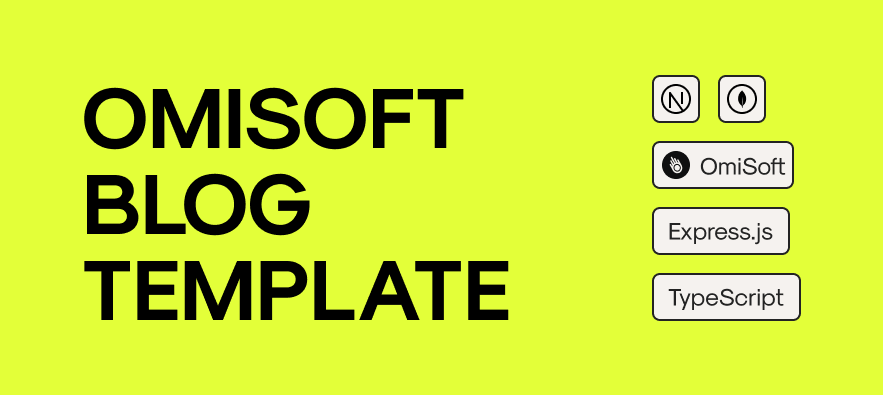

# OMISOFT BLOG EXAMPLE - BACK END

Here you can find a simple boilerplate for a Blog based on React.js & Next.js. We use this code in the project [SudokuPro.app](https://sudokupro.app)

To run this app configure MongoDB url & JWT Secret in the [.env.development](./.env.development):

```
MONGODB_CLUSTER_URL={{mongodb}}
JWT_SECRET={{SOME_VALUE}}
NODEMAILER_EMAIL={{SOME_VALUE}}
NODEMAILER_IMAP_PASSWORD={{SOME_VALUE}}
```

And run next commands:

```bash
npm run i
npm run dev
```

Finally, you can open next url-s:
- [http://localhost:5050](http://localhost:5050) with your browser to see the result.
- [http://localhost:5050/swagger](http://localhost:5050/swagger) with your browser to see Swagger documentation.

## Preview


## Created by
[OmiSoft](https://omisoft.net/?utm_source=github&utm_medium=social)

[![OmiSoft.net Facebook page][1.1]][1]
[![OmiSoft.net Twitter page][2.1]][2]

[1]: http://www.facebook.com/omisoftnet
[2]: http://www.twitter.com/omisoftnet

[1.1]: http://i.imgur.com/fep1WsG.png (OmiSoft.net Facebook page)
[2.1]: http://i.imgur.com/wWzX9uB.png (OmiSoft.net Twitter page)

## License
OMISOFT BLOG EXAMPLE is released under the MIT license.  
See the [LICENSE](./LICENSE.md) for details.